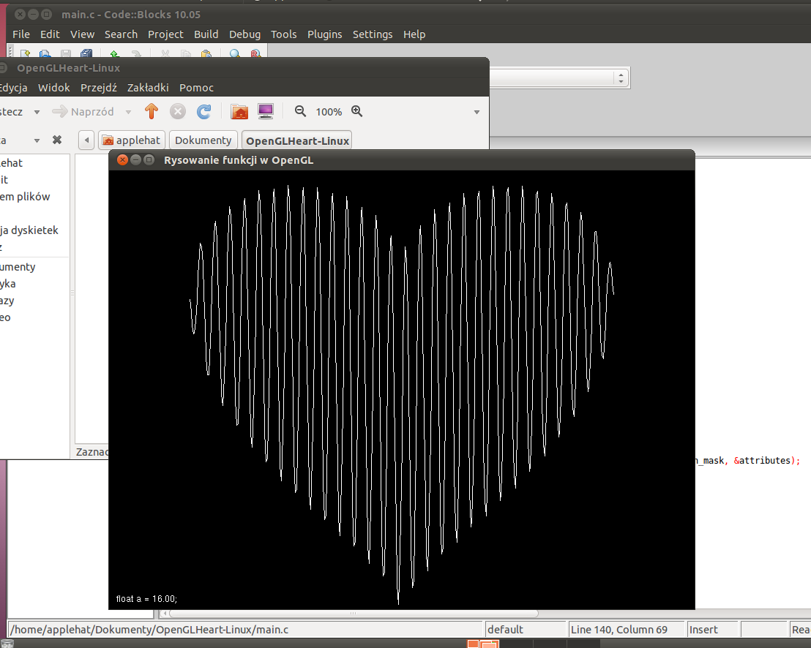
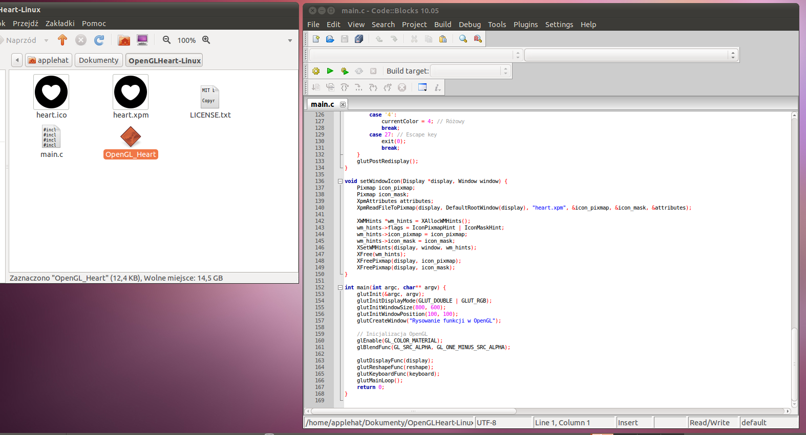

## OpenGL_Heart dla systemów Linux
Jeżeli używasz systemów Linux (albo GNU/Linux... będe nazywać to jak wcześniej) to wykonałem port tego projektu.
Sam projekt napewno uruchamia się na Ubuntu 11.04 dla komputerów i386, ale zapewnie też zadziała na wersjach AMD64

z powodu użycia biblioteki OPENGL (`-lGL`), która nie posiada statycznych bibliotek (*.a) nie można skompilować jako plik statyczny. Aby skompilować to samemu najpierw trzeba pobrać biblioteki:
```bash
sudo apt-get update
sudo apt-get install libgtk2.0-dev libxpm-dev libgl1-mesa-dev freeglut3-dev libx11-dev
```

i potem skompilować samemu przy użyciu:
```bash
gcc -o OpenGL-Heart main.c `pkg-config --cflags --libs gtk+-2.0` -lGL -lGLU -lglut -lX11 -lXpm -lm -std=c99
```



(daj mi znać w sekcji *issues* jeżeli są problemy na innych)
Jedynym brakiem w tym porcie to brak ikony przy programie, mimo że zainstalowałem biblioteki X11, program imagemagick (dla konwersji z ico na xpm) i dodałem kod odpowiadający za wczytywanie. *jak na zdjęciu*



*miło byłoby dowiedzieć się jak to naprawić od was :D*
