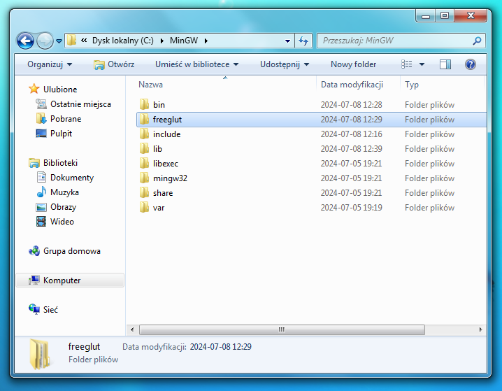
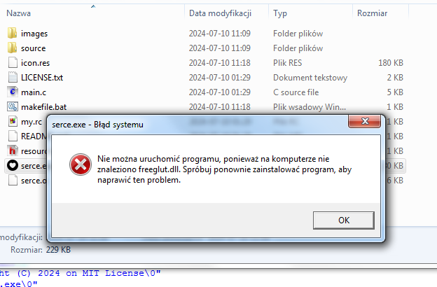
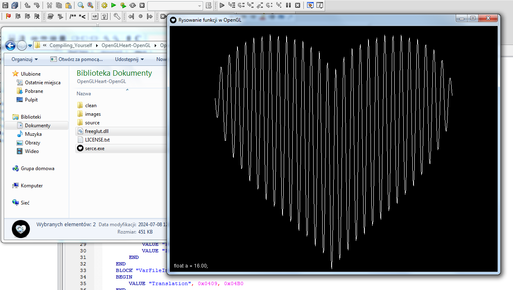

# Kompilowanie OpenGL_Heart dla Win32
Żeby skompilować to repozytorium, potrzebujesz środowiska.
Użyjemy kompilatora <a href="https://sourceforge.net/projects/mingw/files/Installer/mingw-get-setup.exe/download">MinGW 6.2.0-1 win32</a>,
jeżeli chcesz używać innego kompilatora, to użyj twoja decyzja (jednak zalecane jest użycie MinGW, z powodu biblioteki freeglut). Jako edytora użyjemy programu Code::blocks

Po ustawieniu środowiska, musisz wyodrębnić pliki freeglut 3.0.0 (dla MinGW) którego link do pobrania <a href="https://www.transmissionzero.co.uk/software/freeglut-devel/">jest tutaj.</a>
Co ja zrobiłem to skopiowałem plik freeglut.dll w tym samym folderze gdzie będzie nasz skompilowany program, a pliki freeglut są w ```C:\MinGW\freeglut\```:
<div align='center'>
  
</div>

i wyodrębnij pliki repozytorium do folderu
Vo ja lubie robić, to stworzyć plik ```makefile.bat```, i przy testowaniu kodu (i częstym kompilowaniu), tylko uruchamiać ten plik żeby zrobił mi już skompilowany program.
i to właśnie zrobimy - plik ``makefile.bat`` jest na dole:
```bat
windres my.rc -O coff -o icon.res

gcc -c -o serce.o main.c -I"C:\MinGW\freeglut"

gcc -o serce.exe serce.o icon.res -L"C:\MinGW\freeglut" -lfreeglut -lopengl32 -lglu32 -lgdi32 -luser32 -mwindows
```
po uruchomieniu pliku *.bat projekt zostanie skompilowany.
ostatnią rzeczą którą trzeba zrobić to dodane pliku```freeglut.dll``` do takiego samego folderu. Jak plik nie będzie skopiowany, ukaże się błąd:
<div align='center'>
  
</div>


## gratuluje, Skompilowałeś projekt samodzielnie!
<div align='center'>
  
</div>

### jak będziesz potrzebował pomocy, napisz tutaj albo napisz do mnie na discordzie: *applehat.*
